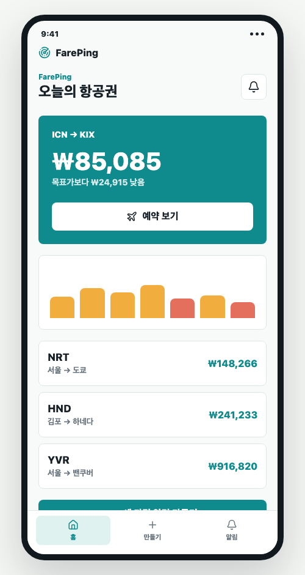
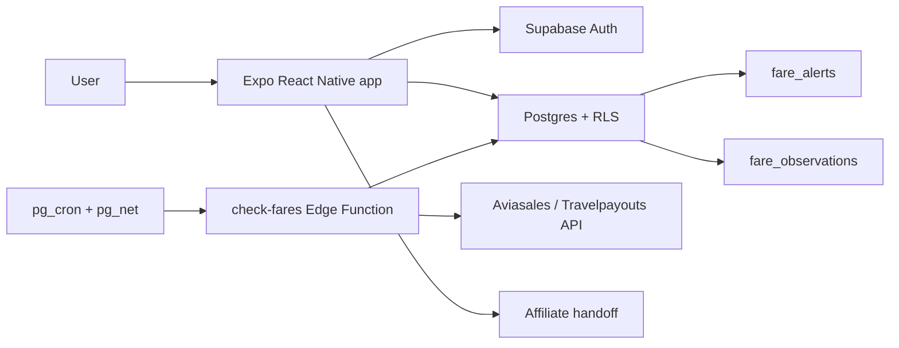

# FarePing

Flight price alert app prototype built with Expo and React Native.

FarePing is a portfolio project exploring a Korean-first flight fare alert product. Users choose departure and arrival airports, trip type, travel dates, target price, passengers, cabin class, stopover preferences, and baggage conditions. The app then stores saved alerts, shows notification-style updates, and supports an affiliate handoff flow.

[Live Demo](https://ddeongkyu.github.io/fare_ping/)



## Why This Project

People who search for cheap flights often repeat the same manual workflow: open Google Flights, Skyscanner, or airline pages, re-enter dates and routes, compare prices, then check again later. FarePing turns that repeated search into a saved alert workflow.

This repository focuses on the product and frontend foundation:

- Korean-first route and airport selection
- Flight alert creation flow
- Target price helper with previous-year price trend UI
- Real alert form inputs for date ranges, target price, passengers, cabin class, stopovers, and baggage
- Notification inbox and alert detail screens
- Supabase auth, RLS-backed user alert persistence, and CRUD management
- Supabase Edge Function starter for server-side Aviasales checks
- Affiliate-link handoff architecture without committing private tokens

## Tech Stack

- Expo
- React Native
- React Native Web
- React Native SVG
- lucide-react-native
- Supabase Auth, Postgres, RLS, and Edge Functions

## Project Structure

```text
.
├── App.js                         # Expo entry UI and screen composition
├── src
│   ├── AppRoot.js                  # App state and screen switching
│   ├── components                  # Reusable UI and alert form controls
│   ├── config/appConfig.js         # Public client config
│   ├── data/flightData.js          # Mock flight, airport, and chart data
│   ├── domain/flightAlerts.js      # Alert creation, validation, and formatting
│   ├── navigation/BottomNav.js     # Bottom tab navigation
│   ├── screens                     # Home, create, detail, and notifications
│   ├── services                    # Supabase repositories and affiliate handoff
│   └── theme                       # Colors and shared React Native styles
├── supabase/functions/check-fares  # Edge Function starter for scheduled fare checks
├── scripts/test-aviasales-api.mjs  # Local API validation helper
├── scripts/check-supabase-public.mjs # Public Supabase/RLS smoke test
├── supabase/sql                    # Ordered Supabase schema setup files
├── assets                          # Portfolio screenshots and visual assets
└── mockups.html                    # Static web/app mockup board
```

## Run Locally

```bash
npm install
npm run web -- --port 8081
```

Open [http://localhost:8081](http://localhost:8081).

## Useful Scripts

```bash
npm run web
npm run build:pages
npm run check
npm run test:supabase
npm run test:aviasales
```

`test:supabase` checks that the public Supabase key can read reference airports and cannot expose another user's fare alerts.

`test:aviasales` requires a local API token:

```bash
TRAVELPAYOUTS_TOKEN=your_token_here npm run test:aviasales -- --month=2026-09 --currency=krw --market=kr
```

Do not commit API tokens. This project intentionally keeps API credentials out of the client app.

## Environment

Copy `.env.example` to `.env` when you want to connect the app to Supabase or override the public affiliate handoff URL.

```bash
EXPO_PUBLIC_FAREPING_AFFILIATE_URL=https://www.aviasales.com/
EXPO_PUBLIC_SUPABASE_URL=https://your-project.supabase.co
EXPO_PUBLIC_SUPABASE_PUBLISHABLE_KEY=sb_publishable_your_key_here
```

For a real product, flight API tokens and scheduled price checks should live in a backend or serverless function, not inside the mobile app.

For the Edge Function, copy `supabase/.env.example` to `supabase/.env` locally or set secrets in Supabase:

```bash
npx supabase secrets set TRAVELPAYOUTS_TOKEN=your_token_here
npx supabase secrets set SUPABASE_SERVICE_ROLE_KEY=your_service_role_key
npx supabase secrets set FAREPING_CRON_SECRET=your_random_cron_secret
npx supabase functions deploy check-fares
```

Never expose the service role key in the Expo app.

## Architecture



## Current Status

This is a frontend/product prototype, not a production release.

Done:

- App shell and bottom navigation
- Home, create alert, notification inbox, and detail screens
- Real alert form inputs for route, date ranges, price, passengers, cabin, baggage, and stopovers
- Alert create, update, pause/resume, and delete flows
- Portfolio-ready public repo cleanup
- Ordered Supabase SQL schema for auth profiles, fare alerts, fare observations, notifications, and RLS
- Supabase client setup, email/password auth screen, airport reads, and user-owned alert persistence
- Public Supabase/RLS smoke test script
- Aviasales scheduled check Edge Function starter and optional cron SQL template

Next:

- Deploy and test the `check-fares` Edge Function with real secrets
- Send queued notifications through push/email providers
- Production build setup with EAS

## Security Notes

- `.env` files are ignored by Git.
- The default affiliate URL is a public placeholder.
- Travelpayouts/Aviasales API tokens should only be used through secure backend infrastructure.
- The Expo app only uses Supabase publishable keys. User data isolation depends on RLS.
